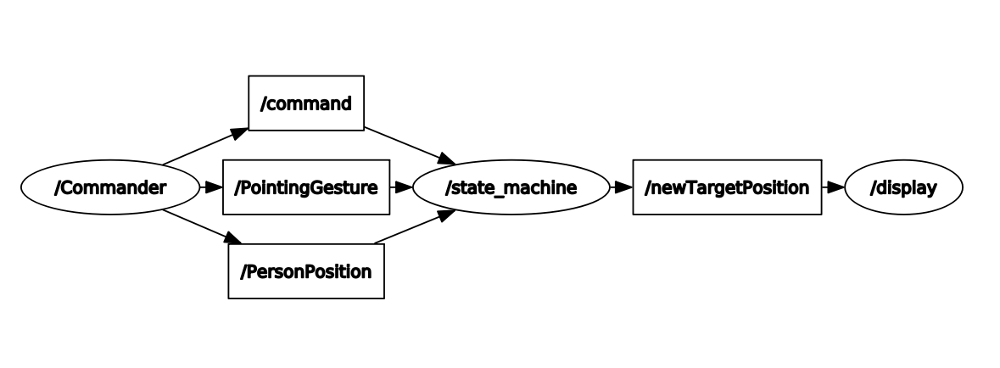

# Assignment 1 - EXPRO
# Behavioral Architecture
Let us consider a simulating pet robot, MIRO, which interacts with a human and moves in a certain 2D environment. 
The robot may have three behaviors : 
1. normal - In this mode, the robot moves randomly
2. sleep - In this mode, it gets to its home position then it sleeps for some time and returns to its normal behavior
3. play- In this mode, it goes to person location, waits for a poiting gesture, goes in the pointed location, comes back to the person and waits for the next pointing gestures. After some time it returns to the normal behavior)
## ROS Architecture
The system is composed by 3 nodes:
"Commander" node
"state_machine" node
"Display" node, and a Launch file. 
The rqt_graph is showed.

## Commander node
The node simulates user action. Firstnof all it chooses randomly what the robot has to perform either sleep or play. The command (std_msgs/String) is published on a Topic ("/Command"). In case the play behavior is selected, the node generates randomly the location of the user and the Pointing Gesture. These poses (geometry_msgs/Point) are published on two topics ("/PersonPosition" and "/PointingGesture").

## State machine node
The node implements a state machine in which the three possible behaviors are defined.
The state machine starts with a Normal behavior state, and it can transit to sleep state or to play state, or it can keep a normal state. The command to switch to another state is received by "Commander" node by the topic "/Command". When it is in a Play state or in a Sleep state, it can just go back in the normal state. The ROS message geometry_msgs/Point is used to rapresent the 2D robot's position (leaving z component always equal to 0). The target position belongs exclusively to the map (11x11 grid). In the normal state, they are generated by "GenerateRandomPosition" function; in the play state, the person position and pointing gesture are received by "Commander" node through two topics; while in the sleep state the home position is defined (1,1). For each state, the target positions are sent to the "display" node, publishing them on "NewTargetPosition" topic. When this happens, the system waits for a default time (4 seconds) until the robot reaches the desired pose. This means that further targets has not been accepted while the robot is moving.

## Display node
The node is a simple simulator; it subscribes to a "newTargetPosition" topic and wait for a message. When the target is received, it prints on terminal what the robot is doing and the behavior state.

## Installation
The first thing to do, after having cloned the repository in the Ros workspace, is to build the package, using the following commands in the shell:

```
cd "yourWorkspace"_ws
catkin_make

```
To run the system:

```
roslaunch assignment1_ExRoLab ass1.launch

```
In another terminal run:

```
rosrun assignment1_ExRoLab Commander.py 

```
To visualize the smach viewer:

```
rosrun smach_viewer smach_viewer.py

```
## Working Hypothesis
The assumptions are:

When it starts, the normal state preempts other states.
From the normal behavior, the robot can play or sleep or stay in normal state yet.
The command to go to sleep or play is received by the Commander node.
From the play state, as well as from the sleep state, the robot can only go to the normal state.
The random position in the normal state is defined by "GenerateRandomPosition" function.
The home position is fixed (1,1,0).
The person location and the pointing gesture are received by the Commander node.
During the execution of one state, after giving a target, the robot waits for a while (predefined time).
System's features
The sys can show on the terminal what the robot is doing and the what the behavior's state is executing.

## Limitations
The user actions is randomly defined by the system, and there exists neither a real relationship with the user nor a real pointing gesture. The robot has not a velocity to get him desired target position, and there is not a real simulator to view if the target is achieved.

## Possible technical Improvements
A possible technical improvements may be:

An interaction with the user can be created
We can Implement a real velocity to change the odometry of the robot
A simulator like turtlebot, Gazeboo can be used,
